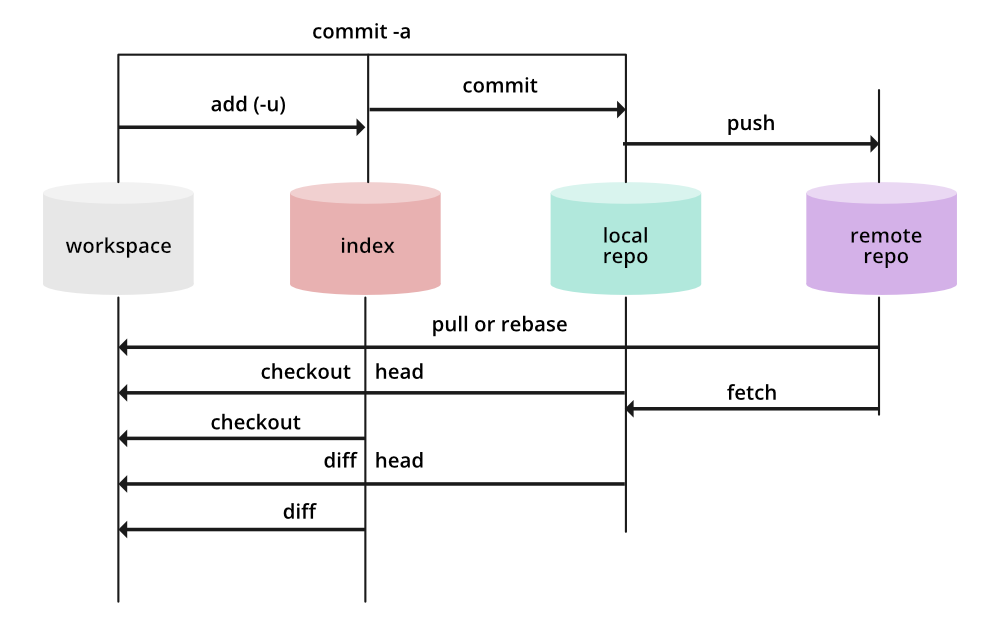

# git101

idea of git:

1) working Directory

2) Staging Area

3) Local Repositroy

4) Remote Repository.

command:

    - git add --all

    - git commit -m "for Title" -m "for Description"

    - git push origin main

    - git pull origin main

    - git log : used to checking commit history